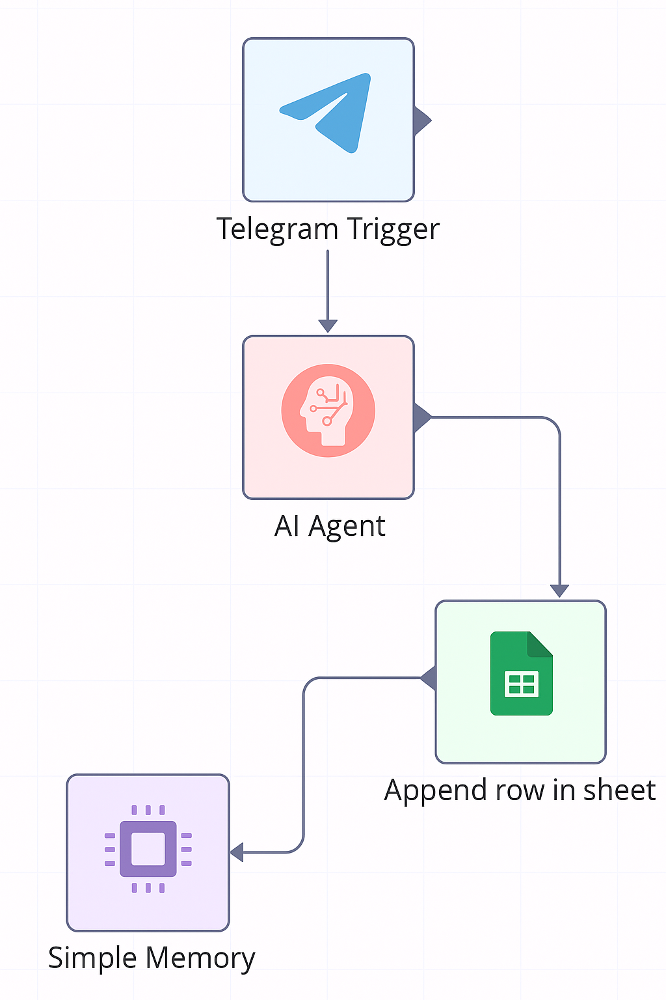

# Telegram Expense Tracker with n8n, Google Sheets & OpenAI

This project is an **automated expense tracker** built using the **n8n workflow automation platform**.  
It integrates **Telegram**, **Google Sheets**, and **OpenAI GPT-4o-mini** to log expenses directly from a Telegram bot.

---

## **Flow Diagram**



---

## **How It Works**

1. **User Sends Expense via Telegram**
   - Send a message to your bot like:  
     ```
     Spent 250 INR on lunch with friends
     ```
   - The **Telegram Trigger** node in n8n captures this message.

2. **AI Agent Processes the Message**
   - The message is sent to the **OpenAI GPT-4o-mini** model via the **AI Agent** node.
   - The AI:
     - Extracts **Date, Personal/Business, Description, Amount (INR), and Type**.
     - Determines if the expense is personal or business.
     - Prepares the data for Google Sheets.

3. **Google Sheets is Updated Automatically**
   - The **Google Sheets Append Row** node adds the extracted data to your sheet.
   - Example spreadsheet entry:

     | Date       | Personal/Business | Description | Amount (INR) | Type  |
     |-----------|------------------|-------------|-------------|------|
     | 2025-08-02| Personal          | Lunch       | 250         | Food |

4. **Bot Confirms the Entry**
   - A confirmation message is sent back to the user via **Telegram Send Message**:
     ```
     ✅ Expense added!
     Date: 2025-08-02
     Personal/Business: Personal
     Description: Lunch
     Amount (INR): 250
     Type: Food
     ```

---

## **Workflow Nodes Overview**

- **Telegram Trigger** – Listens for messages from your bot.
- **AI Agent (LangChain in n8n)** – Extracts and structures expense data using OpenAI GPT-4o-mini.
- **Simple Memory Node** – Maintains conversation context with the user.
- **Google Sheets Append Row** – Updates the expense sheet automatically.
- **Telegram Send Message** – Sends a confirmation to the user.

---

## **Setup Instructions**

### **1. Prerequisites**
- n8n installed and running (local or cloud)  
- A Telegram Bot created via **@BotFather**  
- A Google Sheet to store expenses  
- OpenAI API key for GPT-4o-mini  

---

### **2. Configure n8n**
1. Import the provided JSON workflow into n8n.
2. Set up the following credentials in n8n:
   - **Telegram API** (Bot token from BotFather)
   - **Google Sheets OAuth2**
   - **OpenAI API Key**
3. Update the **Google Sheet ID** in the workflow if necessary.

---

### **3. Activate and Test**
- Enable the workflow in n8n.
- Send an expense message to your Telegram bot.
- Check your Google Sheet for the new entry.

---

## **Example Usage**

1. Send to the bot:  
   ```
   Bought petrol for 1200 INR
   ```
2. Bot responds:  
   ```
   ✅ Expense added!
   Date: 2025-08-02
   Personal/Business: Personal
   Description: Petrol
   Amount (INR): 1200
   Type: Fuel
   ```
3. Google Sheet automatically updates.

---

## **Key Features**
- **AI-powered** expense parsing with GPT-4o-mini  
- **Automated** Telegram → Google Sheets logging  
- **Context-aware** conversation using memory node  
- **Real-time** updates with instant confirmations  
